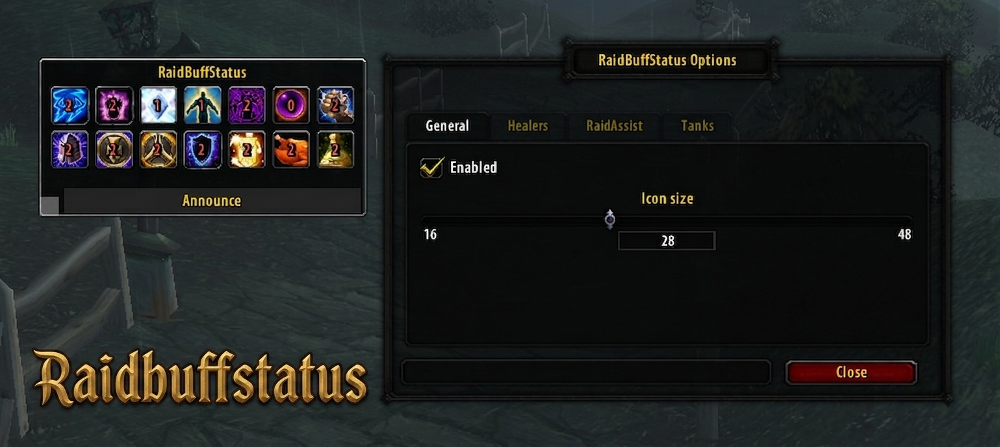
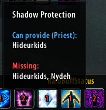
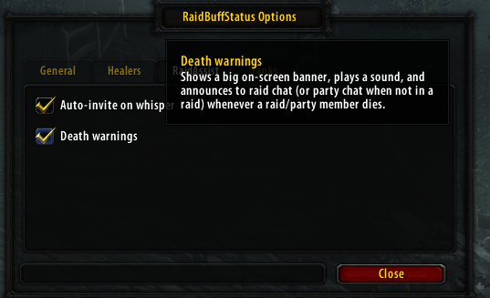
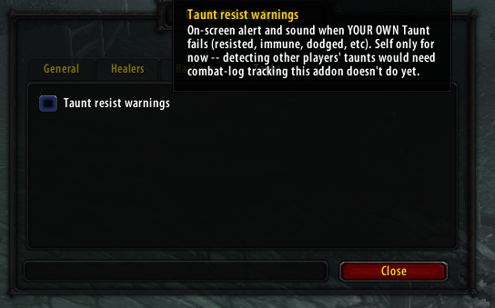
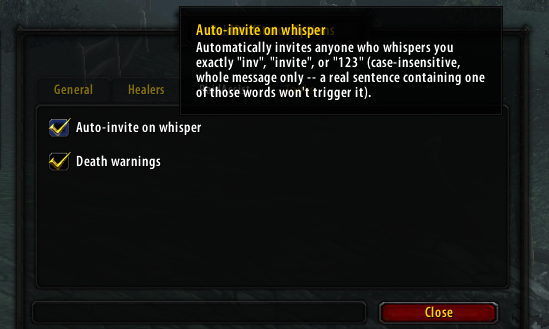
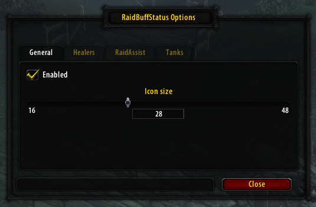

# RaidBuffStatus

**A raid-wide buff tracker for TurtleWoW/OctoWoW.** One compact, resizable icon bar that shows,
at a glance, which class buffs each raid or party member is missing — no more asking in chat
"who doesn't have Fortitude?"

<!-- Hero screenshot: the main window with several buff icons, hovering one to show its tooltip -->


## What it does

RaidBuffStatus watches your current raid or party and, for each tracked buff, tells you two
things: who in the group can even cast it, and who's currently missing it. Hover any icon for
the full breakdown, click **Announce** to post a summary to raid/party chat, and drag the grip
in the corner to resize the window — the icon grid reflows and re-centers itself automatically.

## Features

### Buff tracking
One icon per tracked buff, each showing a live count of how many people are missing it (green
when everyone has it, red otherwise):

- Arcane Intellect, Mark of the Wild / Gift of the Wild, Power Word: Fortitude, Divine Spirit,
  Shadow Protection
- All six long-duration Paladin Blessings individually (Might, Kings, Wisdom, Salvation,
  Sanctuary, Light) — Freedom and Protection are deliberately excluded, since those are
  situational defensive cooldowns, not something a raid maintains on everyone
- Consumables: Well Fed, Flask (matches any flask by name)
- **Soulstone** (Warlock) — special-cased: shows who currently carries an active Soulstone, and
  which raid Warlocks are free to cast a new one vs. on this addon's own *approximate* cooldown
  timer (WoW never exposes another player's real spell cooldown through any API, on any client —
  this is tracked by watching for the Soulstone buff appearing on someone and reading the aura
  tooltip's "Cast by" line, so it only knows about casts it actually witnessed)

<!-- Screenshot: hovering a buff icon, tooltip showing "Can provide" / "Missing" -->


### Resizable, self-centering window
Drag the grip in the bottom-left corner to resize in either direction — the icon grid
recalculates how many icons fit per row live as you drag, and each row centers itself on its
own content (so a short last row doesn't look left-aligned).

### Announce button
Posts one line per buff that at least one person is missing (buffs everyone has are skipped) to
raid chat, or party chat if you're not in a raid:
```
Fortitude = Nydeh
Flask = Too many!
```
A buff missing from more than a few people prints "Too many!" instead of a long name list.

### Death warnings
Optional (Options → RaidAssist): an on-screen alert, a sound, and a raid/party chat message
whenever anyone in your group dies — including yourself.

<!-- Screenshot: RaidAssist tab, Death warnings option -->


### Tank tools
All optional, each independently toggleable in Options → Tanks:

- **Taunt resist warnings** *(self only, for now)* — an on-screen alert when **your own** Taunt
  fails (resisted, immune, dodged, etc.). Detecting *other* players' taunts isn't implemented yet.
- **Mocking Blow use-announce** — posts to raid/party chat whenever you use Mocking Blow, naming
  your current target (with its raid mark, if any).
- **Auto-remove Blessing of Salvation** — cancels Blessing of Salvation / Greater Blessing of
  Salvation on yourself the instant it's detected, since it reduces threat generation.
- **Announce misses at fight start** — for a configurable window after entering combat (default 8s),
  posts your own melee misses/dodges/parries against your target to raid/party chat, an early
  warning that threat isn't established yet.

<!-- Screenshot: Tanks tab -->


### Auto-invite
Optional (Options → RaidAssist): automatically invites anyone who whispers you exactly `inv`,
`invite`, or `123`.

<!-- Screenshot: RaidAssist tab, Auto-invite option -->


### Raid cooldown tracker *(BETA — actively being tested, off by default)*
A separate floating window (icon + countdown, no boxed panel) listing, for every tracked ability,
every raid/party member of the matching class — **without** requiring anyone else in your raid to
run this addon. Each row is a permanent "who has this" entry showing either "Ready" (green) or a
red countdown, so the list stays static instead of icons popping in and out as cooldowns start and
end. Currently tracks: Innervate, Battle Rez, Bloodlust, Heroism, Spirit Link Totem, Ascendance,
Lightwell, Shield Wall, Challenging Shout, Berserker Rage, Pummel, Disarm, Lay on Hands, Blessing
of Protection, Divine Shield, Divine Intervention, Challenging Roar, Mana Tide Totem,
Reincarnation, Tranquilizing Shot, Kick, Vanish, and Evasion — each individually toggleable in
Options → Cooldowns (turning off abilities you don't care about keeps the list shorter).

This is new and still being verified in-game, so a few things are expected to be rough around the
edges for now:
- Only casts this client actually witnesses *while running* are tracked — a cooldown already in
  progress before you logged in reads as "ready" until the next real cast. (An in-progress
  cooldown DOES survive closing and reopening the game entirely, once it's been witnessed once.)
- Detection uses two different techniques depending on the ability: most are caught by watching
  for the resulting buff to appear (Innervate, Bloodlust, Heroism, Shield Wall, Berserker Rage,
  Divine Shield, Blessing of Protection, Mana Tide Totem, Evasion, Spirit Link Totem, Lightwell);
  a few rely on the combat log instead, which has been confirmed unreliable for plain self-buffs on
  this client — so Battle Rez, Vanish, and the various interrupts/taunts currently don't get
  detected at all.
- Several exact spell names and cooldown durations (Ascendance, Spirit Link Totem, Heroism, Battle
  Rez) are best-guess placeholders, since these aren't vanilla-original abilities and this server
  has its own class changes — expect corrections as this gets tested further.

### Settings window
A full AceConfig-based options dialog with the same dark theme used across this client's
addons, split into General, RaidAssist, Healers, Tanks, and Cooldowns tabs (Healers is currently a
placeholder for future options).

<!-- Screenshot: settings window -->


## Installation

1. Download or clone this repository.
2. Copy the `RaidBuffStatus` folder into your `Interface\AddOns\` directory.
3. Restart the client (or reload the UI with `/reload`) and enable RaidBuffStatus at the
   character select screen if it isn't already checked.

## Usage

- **`/rbs`** or **`/raidbuffstatus`** — shows/hides the window.
- **`/rbs options`** (or **`/rbs config`**) — opens the settings window.
- **`/rbs debug`** — dumps a fresh scan of every tracked buff straight to chat, for
  troubleshooting.
- **`/rbs tauntdebug`** — toggles verbose combat-log output for the taunt-warning feature, for
  troubleshooting.
- **`/rbs cddebug`** — toggles verbose combat-log output for the cooldown tracker (beta), for
  troubleshooting.
- **`/rbs cdstate`** — dumps the cooldown tracker's current internal state (enabled? window shown?
  what's actively tracked right now) straight to chat.
- **`/rbs cdtest`** — injects a fake 30-second cooldown so the cooldown window's position/rendering
  can be checked without waiting for a real cast.
- **`/rbs ssdebug`** — toggles verbose tooltip output for Soulstone caster detection, for
  troubleshooting.
- Drag the title bar to move the window; drag the bottom-left grip to resize it.

## Dependencies

- **ClassicAPI — required.** Buff detection is built on `C_UnitAuras.GetAuraDataByIndex`, which
  ClassicAPI provides; without it, this addon cannot scan buffs at all.
- **Ace3 (AceGUI-3.0 + AceConfig-3.0) is bundled in `Libs\`** — nothing else to install for the
  settings window to work.

## Notes

- Interface version targets patch 1.12-era clients (TurtleWoW/OctoWoW). Not tested on retail or
  other Classic variants.
- No class restriction — anyone can run it to keep an eye on raid buff coverage.

## Author

**Hideurkids**
