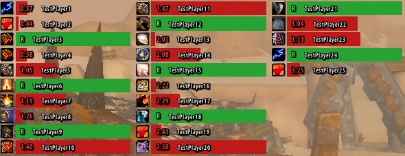
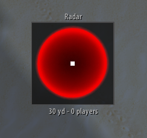

# RaidBuffStatus

**A raid-wide buff and cooldown tracker for TurtleWoW/OctoWoW.** One compact, resizable icon bar
that shows, at a glance, which class buffs each raid or party member is missing — no more asking
in chat "who doesn't have Fortitude?" — plus a separate raid-cooldown tracker for Innervate,
Bloodlust, Battle Rez, and more.

<!-- Hero screenshot: the main window with several buff icons, hovering one to show its tooltip -->


## What it does

RaidBuffStatus watches your current raid or party and, for each tracked buff, tells you two
things: who in the group can even cast it, and who's currently missing it. Hover any icon for
the full breakdown, left-click to announce that buff's status to raid/party chat, right-click to
whisper everyone who can provide it and ask them to, or click **Announce** to post a summary of
every missing buff at once. Drag the grip in the corner to resize the window — the icon grid
reflows and re-centers itself automatically.

A separate, optional window (the Cooldowns tracker) does the same thing for raid-utility
cooldowns — Innervate, Bloodlust, Battle Rez, Ascendance, and more — showing one row per person
who can provide each one, "Ready" in green or a live countdown in red. It works without requiring
anyone else in the raid to run this addon.

## Features

### Buff tracking
One icon per tracked buff, each showing a live count of how many people are missing it (green
when everyone has it, red otherwise):

- Arcane Intellect / Arcane Brilliance, Mark of the Wild / Gift of the Wild, Power Word:
  Fortitude, Divine Spirit, Shadow Protection
- All six long-duration Paladin Blessings individually (Might, Kings, Wisdom, Salvation,
  Sanctuary, Light) — Freedom and Protection are deliberately excluded, since those are
  situational defensive cooldowns, not something a raid maintains on everyone
- Consumables: Well Fed, Flask (matches any flask by name)
- **Soulstone** (Warlock) — special-cased: shows who currently carries an active Soulstone, and
  which raid Warlocks are free to cast a new one vs. on this addon's own *approximate* cooldown
  timer (WoW never exposes another player's real spell cooldown through any API, on any client —
  this is tracked by watching for a Soulstone cast, via SuperWoW's `UNIT_CASTEVENT` when
  available, or by watching for the Soulstone buff appearing and reading the aura tooltip's
  "Cast by" line otherwise)

Left-click any icon to announce that specific buff's status to raid/party chat. Right-click to
whisper every class member who can provide it, telling them how many people (and, if four or
fewer, who by name) still need it — not available for Soulstone or the consumables, since there's
no fixed "provider" for those.

<!-- Screenshot: hovering a buff icon, tooltip showing "Can provide" / "Missing" -->


### Resizable, self-centering window
Drag the grip in the bottom-left corner to resize in either direction — the icon grid
recalculates how many icons fit per row live as you drag, and each row centers itself on its
own content (so a short last row doesn't look left-aligned).

### Announce button
Posts the status of every buff that at least one person is missing (buffs everyone has are
skipped) to raid chat, or party chat if you're not in a raid:
```
Missing Fortitude: Nydeh - Missing Flask: Nydeh, Danlyr, Siurufa
```
Packs as many buffs as fit into a single 250-character message before starting a new one, instead
of one message per buff -- a buff missing from many people spills onto a continuation line rather
than ever saying "Too many!" or dropping names.

### Death warnings
Optional (Options → RaidAssist): an on-screen alert, a sound, and a raid/party chat message
whenever anyone in your group dies — including yourself. Feign Death is correctly excluded.

<!-- Screenshot: RaidAssist tab, Death warnings option -->


### Healer utilities
- **Mouseover casting** (Options → Healers): every spell or item used from any action bar
  targets whatever unit is under your mouse instead of your current target — lets you heal off a
  raid frame without changing target. Uses Nampower's queue-safe cast when available, with a
  classic target-swap fallback otherwise.

### Tank tools
All optional, each independently toggleable in Options → Tanks:

- **Taunt resist warnings** *(self only, for now)* — an on-screen alert when **your own** Taunt
  fails (resisted, immune, dodged, etc.). Detecting *other* players' taunts isn't implemented yet.
- **Mocking Blow use-announce** — posts to raid/party chat whenever you use Mocking Blow, naming
  your current target (with its raid mark, if any).
- **Auto-remove Blessing of Salvation** — cancels Blessing of Salvation / Greater Blessing of
  Salvation on yourself the instant it's detected, since it reduces threat generation.
- **Announce misses at fight start** — for a configurable window after entering combat (default 8s),
  posts your own melee misses/dodges/parries against your target to raid/party chat, an early
  warning that threat isn't established yet.

<!-- Screenshot: Tanks tab -->


### Auto-invite
Optional (Options → RaidAssist): automatically invites anyone who whispers you exactly `inv`,
`invite`, or `123`.

<!-- Screenshot: RaidAssist tab, Auto-invite option -->


### Raid cooldown tracker *(BETA, off by default)*
A separate floating window (icon + a real progress bar, no boxed panel) listing, for every
tracked ability, every raid/party member of the matching class — **without** requiring anyone
else in your raid to run this addon. Each row is a permanent "who has this" entry showing either
"Ready" (green) or a red countdown, so the list stays static instead of icons popping in and out
as cooldowns start and end.

<!-- Screenshot: the Cooldowns window with a row limit set, wrapped into multiple columns -->


Currently tracks: Innervate, Battle Rez, Bloodlust, Heroism, Spirit Link, Ascendance, Lightwell,
Tranquility, Shield Wall, Challenging Shout, Berserker Rage, Pummel, Disarm, Lay on Hands,
Blessing of Protection, Divine Shield, Divine Intervention, Challenging Roar,
Reincarnation, Tranquilizing Shot, Kick, Vanish, and Evasion — each individually toggleable in
Options → Cooldowns (turning off abilities you don't care about keeps the list shorter). Bloodlust
and Heroism are gated to the caster's actual faction, so a single Shaman never shows both.

Detection is layered: most casts are picked up via SuperWoW's `UNIT_CASTEVENT`, which reliably
covers *any* group member's completed cast (not just your own) when SuperWoW is installed;
abilities that leave a buff behind (Innervate, Bloodlust, Lightwell, Shield Wall, Divine Shield,
etc.) are additionally caught by watching for that buff to appear; the older combat-log path is
kept only as a fallback for players without SuperWoW, since it's confirmed unreliable on this
client for anyone but possibly yourself.

Row icons resolve in three steps — a confirmed spell ID (via Nampower's `C_Spell.GetSpellTexture`)
first, then a live name lookup against the client's own spell cache, then a bundled ~1000-entry
name→icon table — before falling back to a hardcoded guess, so most icons render correctly even
for abilities this server changed from vanilla.

Right-click a row to announce that ability's status to raid/party chat, and hover for a tooltip.
Once you have more rows than fit comfortably in one column, set a row limit (Options → Cooldowns)
and the window wraps into additional columns automatically; **Reset position** puts the window
back at its default spot if it's been dragged somewhere inconvenient. An **experimental** toggle
can additionally hide a person's row for a talent-gated ability (Ascendance, Bloodlust, Heroism,
Spirit Link) if they're confirmed, via a background Inspect scan, not to have the talent.

A few things are still expected to be rough around the edges:
- Only casts this client actually witnesses *while running* are tracked — a cooldown already in
  progress before you logged in reads as "ready" until the next real cast. (An in-progress
  cooldown DOES survive closing and reopening the game entirely, once it's been witnessed once.)
- Several cooldown durations are vanilla-era estimates rather than confirmed values for abilities
  this server changed or added outright (Battle Rez, Ascendance's mana/cast-time details aside,
  Tranquility) — expect corrections as more of these get confirmed in-game.
- The talent-gate scan requires SuperWoW's Inspect range and one scan per person, so a row may
  stay visible for a short while after someone joins even if they don't have the talent.

### Radar *(EXPERIMENTAL, off by default)*
A small floating window showing every raid/party member as a colored dot (tinted by class)
relative to you, rotating so the direction you're currently facing is always up. Needs SuperWoW's
`UnitPosition` — without it, the window stays empty.

<!-- Screenshot: the radar window showing its background circle and player marker -->


Off on every login/reload, regardless of how you left it last session:

- **`/range <yards>`** opens the radar at that range; bare **`/range`** closes it again.
- Options → Radar also has an **Enabled** toggle, plus **Range**, **Window size**, and
  **Reset position** — this one just doesn't persist across a reload the way the rest of the
  addon's settings do.
- Right-click anywhere on the radar to jump straight to its Options tab.
- Drag anywhere on it to reposition.

The background's own drawn circle marks the configured range boundary; anyone up to 5 extra yards
past that (outside the circle, still inside the window) also shows, so you can see who's
approaching the edge before they actually enter range. Hover a dot for a tooltip with that
person's name and live distance in yards. The label under the window shows the configured range
and how many people are currently within it.

### Settings window
A full AceConfig-based options dialog with the same dark theme used across this client's
addons, split into General, RaidAssist, Healers, Tanks, Cooldowns, and Radar tabs.

<!-- Screenshot: settings window -->


## Installation

1. Download or clone this repository.
2. Copy the `RaidBuffStatus` folder into your `Interface\AddOns\` directory.
3. Restart the client (or reload the UI with `/reload`) and enable RaidBuffStatus at the
   character select screen if it isn't already checked.

## Usage

- **`/rbs`** or **`/raidbuffstatus`** — shows/hides the window.
- **`/rbs options`** (or **`/rbs config`**) — opens the settings window.
- **`/rbs debug`** — dumps a fresh scan of every tracked buff straight to chat, for
  troubleshooting.
- **`/rbs tauntdebug`** — toggles verbose combat-log output for the taunt-warning feature, for
  troubleshooting.
- **`/rbs cddebug`** — toggles verbose output (combat log and, when SuperWoW is present,
  `UNIT_CASTEVENT`) for the cooldown tracker, for troubleshooting.
- **`/rbs cdstate`** — dumps the cooldown tracker's current internal state (enabled? window shown?
  what's actively tracked right now) straight to chat.
- **`/rbs overload`** — toggles 25 synthetic cooldown rows, for testing the row-limit/column-wrap
  layout without needing a real 25-person raid on cooldown.
- **`/rbs ssdebug`** — toggles verbose tooltip output for Soulstone caster detection, for
  troubleshooting.
- **`/rbs auradump <name>`** — dumps every aura a given raid/party member (or your current
  target) has, straight to chat, for troubleshooting buff detection.
- **`/rbs talentdump <name>`** — inspects a given raid/party member and dumps every talent they
  have at least one point in, straight to chat.
- **`/range <yards>`** — opens the radar at that range; bare **`/range`** closes it again.
- Drag the title bar to move the main window; drag the bottom-left grip to resize it. The
  Cooldowns window is dragged the same way, from anywhere on it.

## Dependencies

- **ClassicAPI — required.** Buff detection is built entirely on `C_UnitAuras.GetAuraDataByIndex`,
  which ClassicAPI provides; without it, this addon cannot scan buffs at all.
- **SuperWoW — required.** Its `UNIT_CASTEVENT` event is the only reliable way on this client to
  detect *another* player's completed cast (Kick, Challenging Shout, Innervate, Soulstone, etc.)
  — without it, Cooldowns-tracker detection for anyone but possibly yourself falls back to a
  combat-log path confirmed unreliable on this client.
- **Nampower — optional.** Improves mouseover casting (an atomic, queue-safe cast instead of a
  manual target-swap sequence) and Cooldowns-tracker icon resolution (a live spell-texture/name
  lookup instead of only a bundled table or a hardcoded guess). Nothing breaks without it.
- **Ace3 (AceGUI-3.0 + AceConfig-3.0) is bundled in `Libs\`** — nothing else to install for the
  settings window to work.

## Notes

- Interface version targets patch 1.12-era clients (TurtleWoW/OctoWoW). Not tested on retail or
  other Classic variants.
- No class restriction — anyone can run it to keep an eye on raid buff coverage.

## Author

**Hideurkids**
